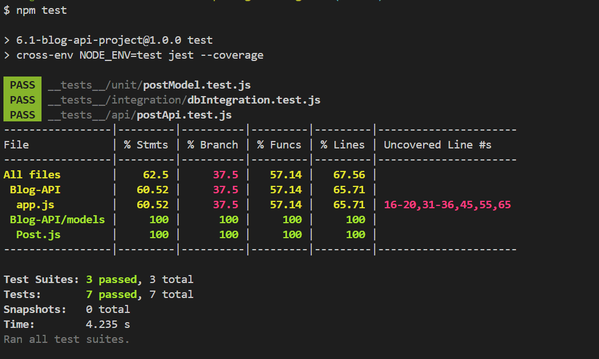

# Blog API

A custom API server for managing blog posts, built using Node.js, Express, and MongoDB Atlas. This project supports full CRUD operations through API endpoints, and includes a simple frontend to interact with the API.

---

## Features

- Create, Read, Update, and Delete blog posts  
- MongoDB Atlas integration via Mongoose  
- Custom API with 4+ endpoints  
- EJS-based frontend for interaction (optional)  
- Environment variables for config management  

---

## API Endpoints

### GET /posts  
Returns all blog posts.

#### Example Response:
```json
[
  {
    "_id": "6651234abcde1234567890",
    "title": "My First Post",
    "content": "This is a test blog.",
    "author": "Alice",
    "date": "2024-08-01T10:00:00.000Z"
  }
]
```

---

### GET /posts/:id  
Fetches a single post by its MongoDB `_id`.

---

### POST /posts  
Creates a new post.

#### Request Body:
```json
{
  "title": "New Blog Post",
  "content": "Blog content here...",
  "author": "Bob"
}
```

---

### PATCH /posts/:id  
Updates an existing post by `_id`.

#### Example Request Body:
```json
{
  "title": "Updated Blog Title"
}
```

---

### DELETE /posts/:id  
Deletes a specific post by `_id`.

---

## Database Used

MongoDB Atlas  
All data is stored in the cloud using MongoDB Atlas and accessed via Mongoose.

### Post Model Fields:
- `title`: String (required)  
- `content`: String  
- `author`: String  
- `date`: Date (auto-filled with current time)

---

## How to Run the Server

### 1. Clone the repository:
```bash
git clone https://github.com/prernaxa/Blog-API.git
cd Blog-API
```

### 2. Install dependencies:
```bash
npm install
```

### 3. Create a `.env` file in the root directory:
```env
MONGO_URI=<your-mongodb-connection-string>
PORT=4000
```

### 4. Start the backend server:
```bash
node index.js
```

---

## How to Run the Frontend (Optional)

The frontend runs separately on port 3001.

### 1. Start the frontend server:
```bash
node server.js
```

### 2. Open your browser:
```
http://localhost:3001
```

From here, you can:
- Create new posts  
- Edit existing posts  
- Delete posts  
- View the list of all blog entries  

---

## How to Test the API

You can test the backend using curl, Postman, or any API testing tool.

### Example with curl:
```bash
curl http://localhost:4000/posts
```

---

## Project Structure

```
.
├── models/
│   └── Post.js
├── public/
│   └── styles/
├── views/
│   ├── index.ejs
│   └── modify.ejs
├── .env
├── server.js        # Frontend server (port 3001)
├── index.js         # Backend server (port 4000)
└── README.md
```

---

## Testing

This project includes unit, integration, and API tests written using **Jest**.

### How to Run Tests

```bash
npm test
```

### Test Coverage Summary

All test suites passed:

- `__tests__/unit/postModel.test.js`  
- `__tests__/integration/dbIntegration.test.js`  
- `__tests__/api/postApi.test.js`

**Code coverage:**

- **Statements**: 62.5%  
- **Functions**: 57.14%  
- **Lines**: 67.56%  
- **Branches**: 37.5%  

✅ `Post.js` model file: **100% test coverage**

### Test Report Screenshot



## Submission Summary

- Created 4+ custom API endpoints  
- Integrated MongoDB Atlas for persistent data storage  
- (Optional) Built a frontend to interact with the APIs  
- Provided clear documentation with example requests and responses  

